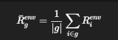

# 청년 노동시장 통합 분석 프로젝트

## 📋 프로젝트 개요

본 프로젝트는 **구조적 정책 진단**, **개인 취업 예측**, **이직 성공 예측** 세 가지 독립 모델을 학습하고, 이를 통합하여 청년 노동시장 정책 의사결정을 지원하는 시스템입니다.

### 핵심 철학
- **개인 책임이 아닌 구조적 위치 기반 진단**
- **예측이 아닌 정책 스크리닝 도구**
- **설명 가능성과 정책 재현성 확보**

---

## 🎯 모델 구성

## 1️⃣ 정책 스크리닝 모델 (Policy Screening Model)

### 목적
본 모델은 청년의 노동시장 단절 위험을 **개인의 노력이나 선택이 아닌 구조적 위치(structural position)**에 기반하여 진단하는 것을 목표로 한다.  
행정 판단을 자동화하거나 개인을 평가하는 모델이 아니라, **정책 대상자를 1차로 선별(Screening)**하고 정책 자원 배분의 효율성을 검증하기 위한 정책 지원 도구이다.

- 행정 결정 대체 ❌
- 정책 대상자 1차 선별 ⭕
- 정책 자원 배분 효율성(Lift) 검증 ⭕
- 설명 가능성(Explainability)·정책 재현성 확보 ⭕

---

### 핵심 개념
- **환경 위험 모델 (Environment Risk Model)**  
  지역·연령·성별·학력·혼인 상태 등 개인이 단기간에 변경할 수 없는 구조적 변수만을 활용하여 노동시장 단절 위험을 추정

- **개인 취업확률 모델 (Employment Probability Model)**  
  동일한 구조적 환경 하에서 개인이 노동시장에 재진입할 가능성을 확률로 추정  
  정책 해석이 가능한 calibrated probability 제공

- **정책 매트릭스 (Policy Matrix)**  
  환경 위험 × 개인 취업확률을 결합한 2차원 정책 분류 구조

---

### 정책 매트릭스의 구조

각 개인(denoted as i)은 다음의 정책 좌표를 가진다.

PolicyPosition_i = ( R_env_i , P_emp_i )

- R_env_i : 동일한 구조적 환경 집단의 평균 단절 위험
- P_emp_i : 개인의 취업 가능성 확률


이 분리를 통해 개인 책임 전가 없이 구조적 위험과 개인 상태를 구분할 수 있다.

---

### 정책 유형 (4분면 분류)

연령대별 분포 차이를 고려하여 절대 기준값(예: 0.5)이 아닌 **연령대별 분위수 기준(relative threshold)**을 사용한다.

1. **고착형 단절 위험군**  
   - 환경 위험 높음, 개인 취업확률 낮음  
   - 구조적 불리함과 개인 취약성이 동시에 존재  
   - 집중 정책 개입 대상

2. **재연결 가능 단절군**  
   - 환경 위험 높음, 개인 취업확률 높음  
   - 단기 개입 시 정책 효과 기대 가능

3. **취업취약 비단절군**  
   - 환경 위험 낮음, 개인 취업확률 낮음  
   - 개인 맞춤형 지원에 적합

4. **안정군**  
   - 환경 위험 낮음, 개인 취업확률 높음  
   - 정책 우선순위 낮음

---

### 학습 및 결합 과정

```python
# 1. 구조적 단절 위험 모델 (GBDT)
df_main = load_eaps_year()
disconnect_model, _, _, _, df_main = run_disconnect_model_enhanced(df_main)

# 2. 개인 취업확률 모델 (GBDT + Calibration)
df_full = load_youth_may_full()
employment_model, _, _, _, df_test = train_employment_gbdt_enhanced(df_full)

# 3. 정책 매트릭스 구성 (환경 × 개인)
df_policy, risk_env = build_hybrid_policy_matrix(df_main, df_test)

# 결과 저장
df_policy.to_csv("results/policy/policy_matrix_final.csv")

핵심 결합 로직

환경 위험은 개인별 확률을 그대로 사용하지 않고, 동일한 구조적 환경을 공유하는 집단 단위로 평균화한다.

환경 단위(KEY) = 조사연월 × 성별 × 연령대


정책 스코어 정의

재연결지수 (Policy Efficiency Index)
정책 투입 대비 성공 가능성을 나타내는 지표

RI=0.3×(1−환경위험)+0.7×취업확률

지원필요도점수 (Need Index)
개입하지 않을 경우 고착될 위험을 나타내는 지표

NS=0.7×환경위험+0.3×(1−취업확률)

모델의 역할 요약

본 정책 스크리닝 모델은 예측 정확도 자체를 목표로 하지 않는다.
구조적 환경 위험과 개인 취업 가능성을 분리·결합함으로써,
개인 책임 전가 없이 정책 개입 우선순위를 제시하는 2차원 정책 분류 도구로 활용된다.

---

### 2️⃣ 취업 확률 예측 모델 (Employment Probability Model)
**목적**: 직업훈련 효과 검증 및 청년 취업 결정 요인 분석

#### 핵심 가설
"직업훈련 경험이 있는 청년의 취업 확률이 높으며, '쉬었음' 상태는 취업에 가장 큰 부정적 영향을 미친다"

#### 모델 구조
- **로지스틱 회귀 (LR)**: 해석 가능성 중심
- **랜덤 포레스트 (RF)**: 비선형 상호작용 포착

#### 학습 과정
```python
# 데이터 준비
df_model = df_youth.copy()
df_model['취업여부'] = (df_model['경제활동상태코드'] == 1).astype(int)
df_model['직업훈련경험'] = df_model['직업교육및직장체험_직업교육수혜구분코드'].isin([2,3,4]).astype(int)

# Train/Test Split
X_train, X_test, y_train, y_test = train_test_split(X, y, test_size=0.3, stratify=y)

# 로지스틱 회귀
model_lr = LogisticRegression(max_iter=1000)
model_lr.fit(X_train, y_train)

# 랜덤 포레스트 (상호작용 변수 포함)
model_rf = RandomForestClassifier(n_estimators=500)
model_rf.fit(X_train_rf, y_train_rf)

# 전체 데이터 예측 저장
df_out["p_employ_lr"] = model_lr.predict_proba(X_all)[:, 1]
df_out["p_employ_rf"] = model_rf.predict_proba(X_all_rf)[:, 1]
df_out.to_csv("results/employment/employment_predictions.csv")
```

#### 출력 변수
- `p_employ_lr`: 로지스틱 회귀 취업 확률
- `p_employ_rf`: 랜덤 포레스트 취업 확률
- `직업훈련경험`: 훈련 이수 여부
- `쉬었음`: 쉬었음 상태 여부

---

### 3️⃣ 이직 성공 예측 모델 (Career Mobility Model)
**목적**: 개인의 이직 성공 가능성 예측 및 행동 변경 가능 요인 제시

#### 핵심 개념
- **이직 성공 확률**: 현재 조건에서 이직 시 성공 가능성
- **Counterfactual 분석**: 어떤 조건을 바꾸면 이직 성공 가능한지 제시

#### 모델 구조
- **CatBoost Classifier**: 범주형 변수 자동 처리, 고성능
- **DiCE (Diverse Counterfactual Explanations)**: 실행 가능한 조건 변경 제시

#### 학습 과정
```python
# 데이터 준비
X = datas_final[feature_cols]
y = datas_2030['이전직장사항_전직유무'].replace(2, 0)  # 1=이직 성공, 0=실패

X_train, X_test, y_train, y_test = train_test_split(X, y, test_size=0.2, stratify=y)

# CatBoost 학습
cat = CatBoostClassifier(
    learning_rate=0.1,
    iterations=800,
    depth=10,
    subsample=0.8,
    scale_pos_weight=0.5
)
cat.fit(X_train, y_train)

# 전체 데이터 예측 저장
df_cbm["cbm_p_success"] = cat.predict_proba(X_all)[:, 1]
df_cbm["cbm_pred"] = cat.predict(X_all)
df_cbm.to_csv("results/cbm/cbm_predictions.csv")
```

#### DiCE 적용
```python
# DiCE 초기화
d = dice_ml.Data(dataframe=df_train, outcome_name='이전직장사항_전직유무')
m = dice_ml.Model(model=cat, backend="sklearn")
exp = Dice(d, m, method="random")

# 반사실적 설명 생성
cf = exp.generate_counterfactuals(
    query_instances=query_row,
    total_CFs=3,
    desired_class=1,
    features_to_vary=ACTIONABLE_FEATURES  # 변경 가능한 변수만
)
```

#### 출력 변수
- `cbm_p_success`: 이직 성공 확률
- `cbm_pred`: 이직 성공 예측 (0/1)
- **Actionable Features**: 구직활동, 직업교육, 직장체험 등

---

## 🔗 모델 병합 프로세스

### STEP 1-3: 데이터 검증
```python
# STEP 1: 정책 매트릭스 구조 점검
df_policy = pd.read_csv("results/policy/policy_matrix_final.csv")
assert all(c in df_policy.columns for c in ["정책유형", "재연결지수", "지원필요도점수"])

# STEP 2: 취업 예측 결과 점검
df_employment = pd.read_csv("results/employment/employment_predictions.csv")
assert all(c in df_employment.columns for c in ["p_employ_lr", "p_employ_rf"])

# STEP 3: 이직 예측 결과 점검
df_cbm = pd.read_csv("results/cbm/cbm_predictions.csv")
assert all(c in df_cbm.columns for c in ["cbm_p_success", "cbm_pred"])
```

### STEP 4: 병합 (PID 기반)
```python
# PID 생성 (행 번호 기반)
df_policy["pid"] = df_policy.index
df_employment["pid"] = df_employment.index
df_cbm["pid"] = df_cbm.index

# 병합
df_merged = (
    df_policy
    .merge(df_employment, on="pid", how="left")
    .merge(df_cbm, on="pid", how="left")
)

# 저장
df_merged.to_csv("results/final/merged_policy_analysis.csv")
```

---

## 📊 모델 평가

### STEP 5-A: 정책 모델 평가
**타깃**: 진성쉬었음 (구조적 단절 상태)

```python
y_true = df["진성쉬었음"]
y_prob = df["지원필요도점수"]

# 확률 품질
print(f"Brier Score: {brier_score_loss(y_true, y_prob):.4f}")
print(f"AUC: {roc_auc_score(y_true, y_prob):.4f}")

# Lift 분석 (Top-K 타겟팅)
for k in [0.30, 0.20, 0.10]:
    n = int(len(y_true) * k)
    top_rate = y_true[np.argsort(y_prob)[::-1][:n]].mean()
    lift = top_rate / y_true.mean()
    print(f"Top {int(k*100)}%: Lift={lift:.2f}배")
```

### STEP 5-B: 이직 모델 평가
**타깃**: 이전직장사항_전직유무 (이직 성공)

```python
y_true = y_test
y_prob = cat.predict_proba(X_test)[:, 1]

# Precision 중심 threshold 탐색
for t in np.arange(0.05, 0.96, 0.01):
    pred = (y_prob >= t).astype(int)
    p = precision_score(y_true, pred)
    if p >= 0.7:  # Precision 70% 이상 유지
        print(f"Threshold={t:.2f}, Precision={p:.4f}")
```

---

## 🚀 API 서버

### 구조
```
POST /persona/policy   → 정책 진단만
POST /persona/cbm      → 이직 예측만
POST /persona/all      → 통합 진단 + 해석 + 권고
```

### 핵심 로직

#### 1. 정책 진단 (`/persona/policy`)
```python
def run_policy(persona):
    # 점진적 필터링 (L1→L4)
    df_grp, level = progressive_filter(df_policy, persona)
    
    # 직업훈련 효과 계산
    no_train = df_grp[df_grp["직업훈련경험"] == 0]
    yes_train = df_grp[df_grp["직업훈련경험"] == 1]
    
    p_no = ((no_train["p_employ_lr"] + no_train["p_employ_rf"]) / 2).mean()
    p_yes = ((yes_train["p_employ_lr"] + yes_train["p_employ_rf"]) / 2).mean()
    
    return {
        "취업확률": {"미이수": p_no, "이수": p_yes, "증가폭": p_yes - p_no},
        "정책유형": yes_train["정책유형"].mode()[0],
        "지원필요도점수": yes_train["지원필요도점수"].mean()
    }
```

#### 2. 이직 예측 (`/persona/cbm`)
```python
def run_cbm(persona):
    X = pd.DataFrame([{f: persona.get(f, 0) for f in CBM_FEATURES}])
    prob = cbm_model.predict_proba(X)[0, 1]
    return {
        "이직성공확률": prob,
        "판정": "성공 가능" if prob >= 0.5 else "실패 가능"
    }
```

#### 3. 통합 진단 (`/persona/all`)
```python
def persona_all():
    policy_res = run_policy(persona)
    cbm_res = run_cbm(persona)
    
    # 개인 안정성 파생
    personal_res = derive_personal_stability(persona, cbm_res)
    
    # 해석 + 권고
    interpretation = interpret_result(policy_res, cbm_res)
    action = recommend_action(policy_res, cbm_res)
    
    return {
        "policy": policy_res,
        "cbm": cbm_res,
        "개인판단": personal_res,
        "해석": interpretation,
        "권고행동": action,
        "추가권고": build_extra_advice(policy_res, cbm_res)
    }
```

### 요청 예시
```bash
curl -X POST http://localhost:5000/persona/all \
  -H "Content-Type: application/json" \
  -d '{
  "성별코드": 2,
  "만연령": 27,
  "연령계층코드": 2,
  "혼인상태코드": 2,
  "교육정도_학력구분코드": 3,
  "교육정도_계열코드": 10,
  "가구주관계코드": 3,
  "가장최근학교_년제수": 2,
  "가장최근학교_휴학경험유무": 1,
  "직업훈련경험": 1,
  "직업교육및직장체험_직업교육수혜구분코드": 1,
  "직업교육및직장체험_취업관련시험준비여부": 1,
  "직업교육및직장체험_취업관련시험준비분야코드": 3,
  "직업교육및직장체험_직장체험주요형태코드": 2,
  "구직사항_구직활동기간": 0,
  "구직사항_주요구직방법1코드": 6,
  "구직사항_주요구직경로1코드": 6
}'
```

### 응답 예시
```json
{
    "cbm": {
        "이직성공확률": 0.053,
        "판정": "실패 가능"
    },
    "policy": {
        "level": "L1(성별+연령)",
        "정책판단": {
            "정책유형": "고착형 단절 위험군",
            "지원필요도점수": 0.27,
            "진성쉬었음비율": 0.0
        },
        "취업확률": {
            "증가폭": -0.016,
            "직업교육_미이수": 0.742,
            "직업교육_이수": 0.726
        },
        "표본수": {
            "미이수": 67,
            "이수": 29
        }
    },
    "개인판단": {
        "개인안정성": "불안정",
        "근거": [
            "직업훈련 이수"
        ],
        "안정성점수": 1
    },
    "권고행동": "정책 개입 우선 대상",
    "추가권고": {
        "개인행동": "개인 이직 시도 비권장",
        "단기전략": "소득·활동 안정화",
        "우선순위": "정책 개입 최우선",
        "주의사항": "개인 실패로 해석 금지",
        "중기전략": "단계적 노동시장 복귀"
    },
    "해석": "구조적 위험이 높아 개인 이직보다는 정책 개입이 우선됩니다."
}
```

---

## 📁 파일 구조

```
project/
├── data/
│   ├── youth_may/           # 청년층 부가조사 원본
│   ├── eaps_year/           # 경제활동인구조사 연간 데이터
│   └── derived/             # 전처리 결과
│
├── models/
│   ├── policy/              # 정책 모델 (disconnect, employment)
│   ├── employment/          # 취업 예측 모델 (LR, RF)
│   └── cbm/                 # 이직 예측 모델 (CatBoost)
│
├── results/
│   ├── policy/
│   │   └── policy_matrix_final.csv
│   ├── employment/
│   │   └── employment_predictions.csv
│   ├── cbm/
│   │   └── cbm_predictions.csv
│   └── final/
│       └── merged_policy_analysis.csv
│
├── notebooks/
│   ├── 01_policy_screening.ipynb
│   ├── 02_employment_prediction.ipynb
│   ├── 02_1_check_cbm_predictions.ipynb
│   ├── 03_cbm_model.ipynb
|   ├── 04_merge_evaluation.ipynb
|   ├── 05A_policy_probabilistic_evaluation.ipynb
│   └── 05B_cbm_model_evaluation.ipynb
│
└── api/
    └── app.py
```

---

## 🛠️ 실행 방법

### 1. 환경 설정
```bash
pip install -r requirements.txt
```

### 2. 모델 학습 (순서대로 실행)
```bash
# 0. 입력 데이터 및 컬럼 구조 점검
python notebooks/00_check_inputs.ipynb

# 1. 정책 매트릭스 산출 결과 점검
python notebooks/01_check_policy_matrix.ipynb

# 2-1. 이직(CBM) 예측 결과 점검
python notebooks/02_1_check_cbm_predictions.ipynb

# 2-2. 취업 확률(LR/RF) 예측 결과 점검
python notebooks/02_check_lrrf_predictions.ipynb

# 3. 정책 스크리닝 모델 병합 및 1차 평가
python notebooks/03_merge_and_evaluate_policy.ipynb

# 4. 정책 × 취업확률(LR/RF) 병합
python notebooks/04_merge_policy_lrrf.ipynb

# 5-A. 정책 스크리닝 모델 확률 품질 평가
python notebooks/05A_policy_probabilistic_evaluation.ipynb

# 5-B. 이직(CBM) 모델 성능 평가
python notebooks/05B_cbm_model_evaluation.ipynb
```

### 3. API 서버 실행
```bash
python api/persona_api.py
# http://localhost:5000 에서 실행
```

---

## 📌 핵심 특징

### 1. 구조와 개인의 분리
- **정책 모델**: 환경 위험(구조) × 개인 취업확률(개인)
- **개인 책임론 배제**: "노력 부족"이 아닌 "구조적 위치" 진단

### 2. 정책 실무 친화적
- **4개 정책군**: 명확한 개입 우선순위
- **Lift 검증**: 집중 타겟팅 효율성 측정
- **Calibration**: 확률의 정책적 해석 가능성 확보

### 3. 설명 가능성
- **DiCE**: 이직 실패 시 "무엇을 바꿔야 하는지" 제시
- **Actionable Features**: 개인이 실제로 변경 가능한 요인만 제시
- **Immutable Features**: 성별, 나이 등 불변 요인 보호

### 4. 확장 가능성
- **PID 기반 병합**: 추가 모델 통합 용이
- **API 표준화**: 정책 시뮬레이션, 대시보드 연동 가능
- **모듈화**: 각 모델 독립 운영 가능

---

## 📖 참고 문헌

- 경제활동인구조사 청년층 부가조사 (2021-2025, a마이크로데이터)
- Gradient Boosting Decision Trees (Friedman, 2001)
- Calibrated Classifiers (Platt Scaling, Isotonic Regression)
- DiCE: Diverse Counterfactual Explanations (Mothilal et al., 2020)

---

## 👥 기여자

본 프로젝트는 세 개의 독립 모델을 통합한 협업 연구입니다.

---

## 📄 License

MIT License


---

###CatBoost Architecture+DiCE algorithm for ML###

#모델 사용 및 역할 정의#
이 모델은 ‘이직 성공 가능성’을 예측하고, 실패로 예측된 사용자에게 성공 가능성을 높이기 위한 행동 가이드(recourse)를 제공하는 모델이다.
- 1차 역할: 개인의 현재 상태를 기반으로 이직 성공 확률을 예측
- 2차 역할: 실패로 예측된 경우, 어떤 요소를 어떻게 바꾸면 성공으로 분류되는지를 제안

#모델 목적 1문장#
개인의 구직·교육·경력 관련 정보를 바탕으로 이직 성공 가능성을 예측하고, 성공 확률을 높이기 위한 최소한의 현실적 변화 시나리오를 제시하는 것이 목적이다.

#타깃(y) 정의#
타깃 변수: 이전직장사항_전직유무
0: 이직 실패
1: 이직 성공
이 변수는 실제 조사 데이터에서 관측된 이직 결과로, 모델은 이를 이진 분류(binary classification) 문제로 학습한다.

#손실 함수 & 평가 지표 선택 이유#
손실 함수 (Training)
Logloss (Binary Cross-Entropy)

선택 이유
단순 정답/오답이 아니라 확률 예측의 정확성을 학습할 수 있음. 이후 precision 중심 threshold 정책 및 recourse 생성에 적합

평가지표 (Metrics)
Precision (Class = 1, 이직 성공)
F1-score (보조 지표)
ROC-AUC (참고 지표)
<Precision을 중점으로 본 이유>
이직 성공으로 예측했는데 실제로 실패하는 경우(False Positive)는
사용자에게 잘못된 기대/결정 유도라는 리스크가 큼
따라서 “성공이라고 말할 때는 최대한 확실해야 함”
이 모델은 Recall보다 Precision을 더 중요하게 설계됨

#Train / Test 성능 비교#
Train Accuracy: 약 88%
Test Accuracy: 약 82%
Test Precision (이직 성공): 약 0.72
<해석>
전체 정확도는 안정적이며, 이직 성공 클래스에 대해 보수적인 예측(precision 중심) 성향을 보임
이는 서비스 목적(잘못된 성공 예측 최소화)에 부합

#Overfitting 점검 결과#
다음 기준으로 과적합을 점검하였다:
Train vs Test 성능 비교
Precision / Recall 간 괴리 확인
CatBoost depth, regularization(l2_leaf_reg) 튜닝 결과 확인

<결론>
Train 성능 대비 Test 성능이 급격히 하락하지 않음
모델은 과적합보다는 일반화 성향을 보임
일부 recall 저하는 의도된 설계(precision 우선 정책)의 결과로 해석 가능

